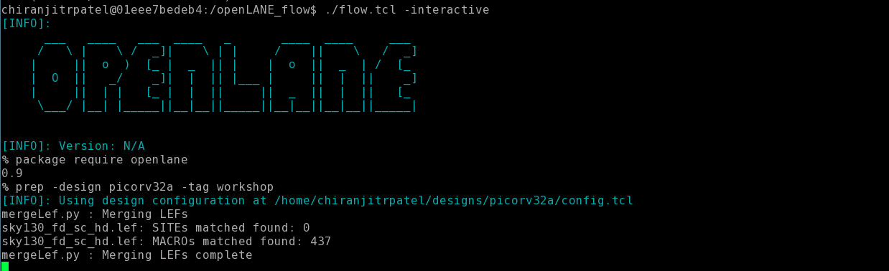

# openLANE-Sky130
The work done during the advanced physical design using the openlane/sky130nm workshop is illustrated in this repository. This is a cloud-based workshop offered by VSD for 5 days. The main objective here is to create, without human interference, a full and clean GDSII.

# Day1-Inception of EDA, OpenLANE and Sky130 PDK open-source
Day one focuses primarily on computer language and getting acquainted with the open source EDA using the picorv32 reference design.

We are concerned with the high density library, as shown in the below figure. There are various flavours of standard libraries also present.

flow.tcl is the file that invokes openLANE, and it is used in the interactive mode, in order to understand the flow.
1
The next step is to import the various packages required to run openLANE. This is done by the package require command as shown below.

The next step is to prepare our design. Iam preparing the jpeg_encoder design. Do the following step:
It should look like this after your design has been prep'ed.
