# OpenLANE-Sky130
The work done during the advanced physical design using the openlane/sky130nm workshop is illustrated in this repository. This is a cloud-based workshop offered by VSD for 5 days. The main objective here is to create, without human interference, a full and clean GDSII.

# Day1-Inception of EDA, OpenLANE and Sky130 PDK open-source
Day one focuses primarily on computer language and getting acquainted with the open source EDA using the picorv32 reference design.

We are concerned with the high density library, as shown in the below figure. There are various flavours of standard libraries also present.

flow.tcl is the file that invokes openLANE, and it is used in the interactive mode, in order to understand the flow.
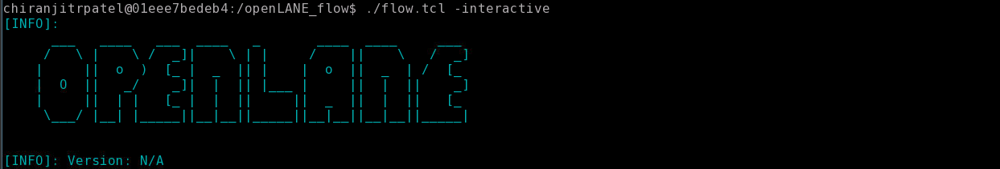
The next step is to import the various packages required to run openLANE. This is done by the package require command as shown below, and the next step is to prepare our design. Iam preparing the picorv32 design. Do the following step:

It should look like this after your design has been prep'ed.
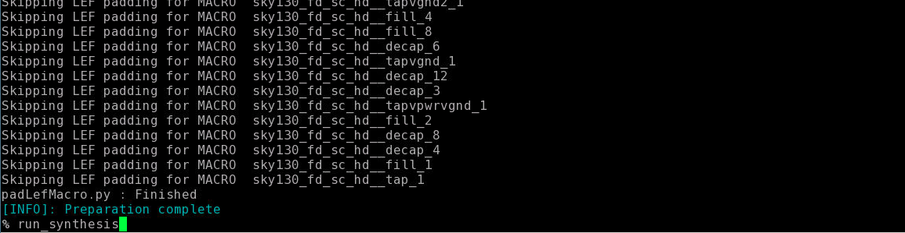
Synthesis of the design is done using the run_synthesis command as shown above.
Synthesis completion is shown as:

# Day2-Chip floorplanning and placement

Floorplan stage is followed after the sysnthesis is performed. the command for runnin floorplan is "run_floorplan"
Floorplan Viewing in Magic
We need to provide three files as input to imagine our floorplan in Magic:
magic tech file, Floorplan Def file and LEF File Merged.
This command is executed in the results/floorplan folder, the merged file is present two levels up, hence the ../../ and the def file is pressent in the floorplan folder.
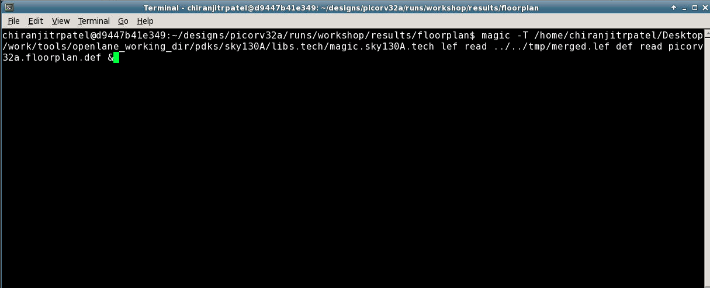
After executing this command, magic invokes, showing us the floorplan:
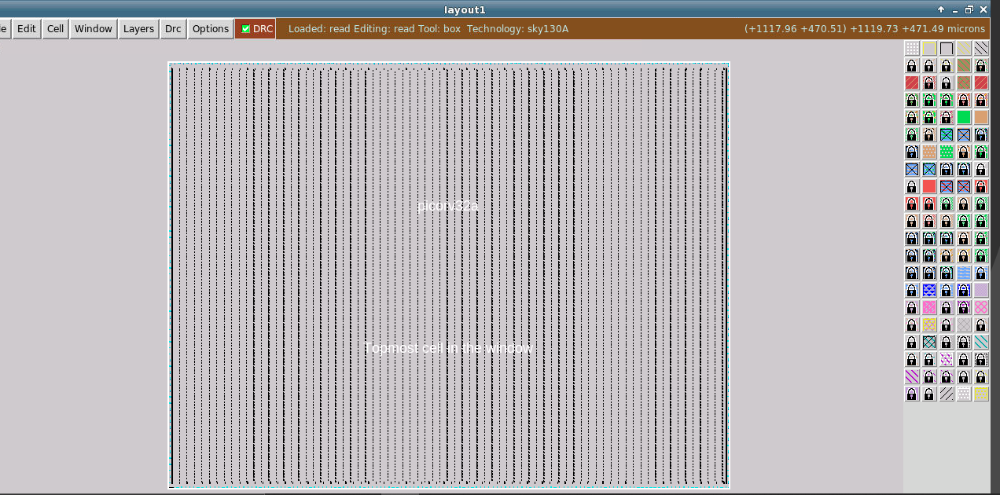
PLACEMENT
The next step after floorplan is placement of standard cells. The command "run_placement" is executed after the floorplan stage is complete.

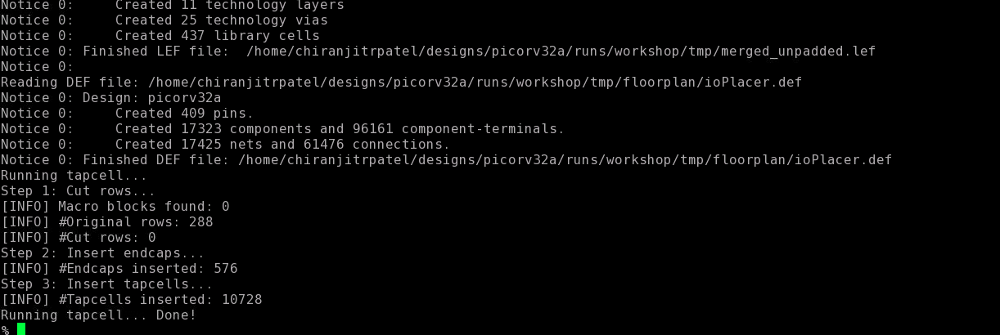
At the end of placement cell legalization will be reported, as follows:
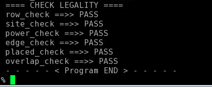

Magic is again invoked to view the placement of cells, and this is done as follows:
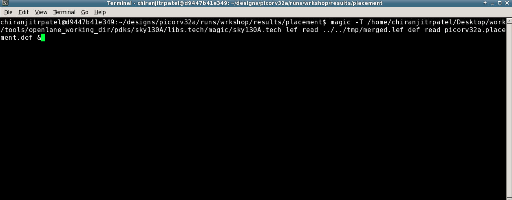

# Day 3 - Design and characterize one library cell using Magic Layout tool and ngspice
Magic Layout View of Inverter Standard Cell

Refer to: https://github.com/nickson-jose/vsdstdcelldesign for cell files.

Clone to library "vsdstdcelldesign" from Git by entering the following command:

This library consists of all the required files for an CMOS inverter.
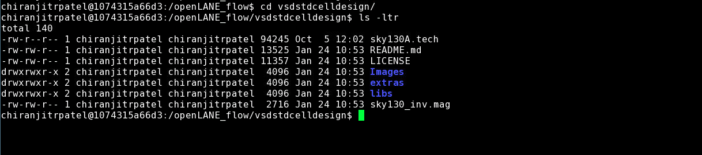
The layout of the inverter is opened by invoking magic and feeding the .tech and .mag files.
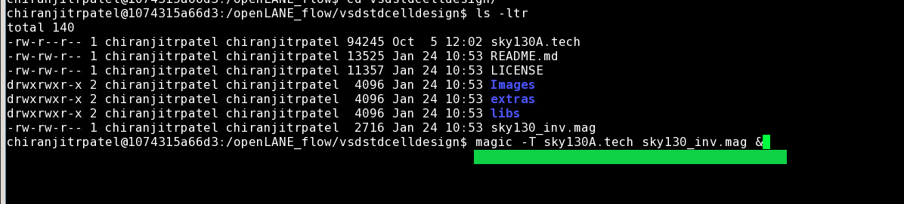

PEX Extraction with Magic
The extraction file is created for the layout, and it is shown in the below pictures.
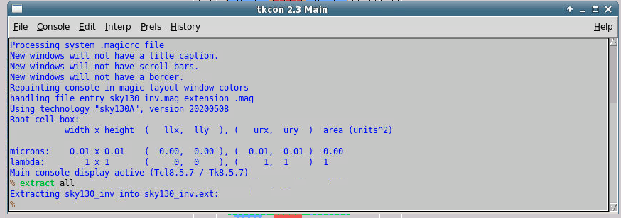
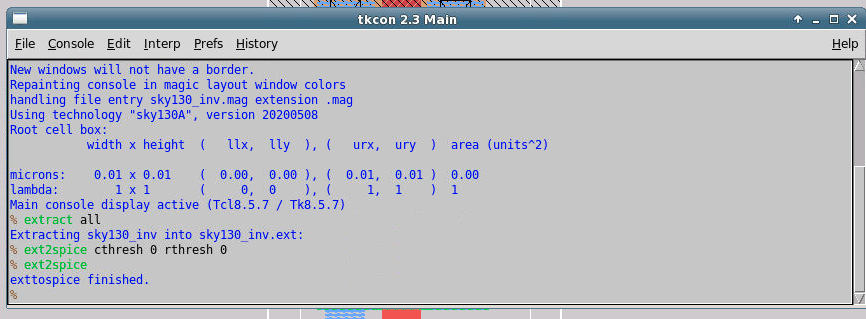
Listing the files present in the vsdstdcelldesign library, we find that there is a new .spice file present. This is nothing but the extracted spice file that we generated eariler.
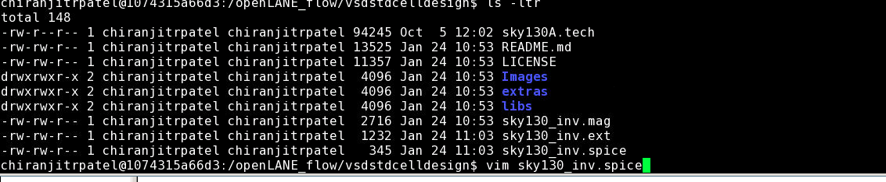
Opening the file using the vim command:
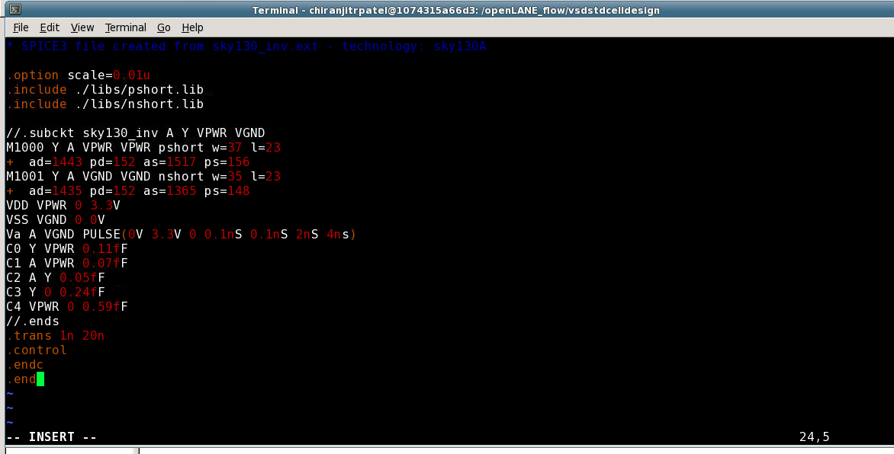
To run the simulation with ngspice, invoke the ngspice tool with the spice file as input:
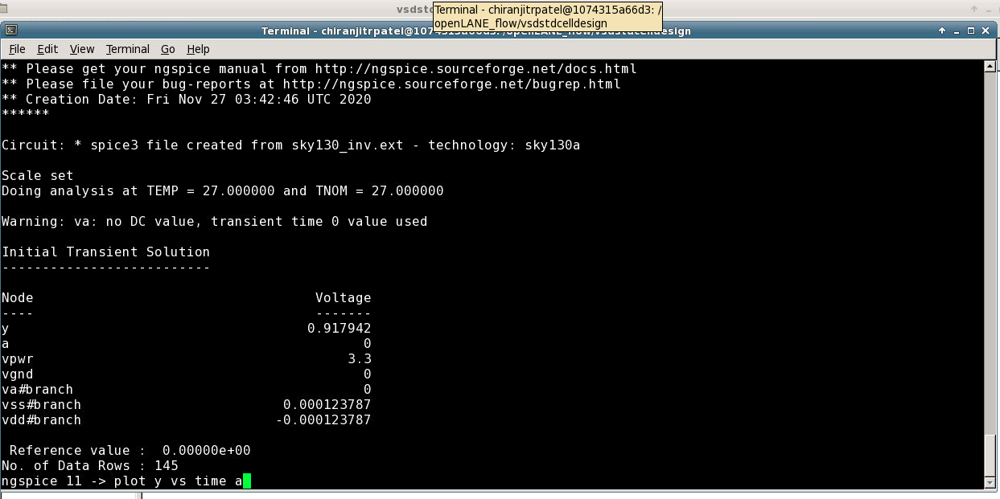
Plotting the transient analysis of the inverter, can be done by plotting the voltage vs time:
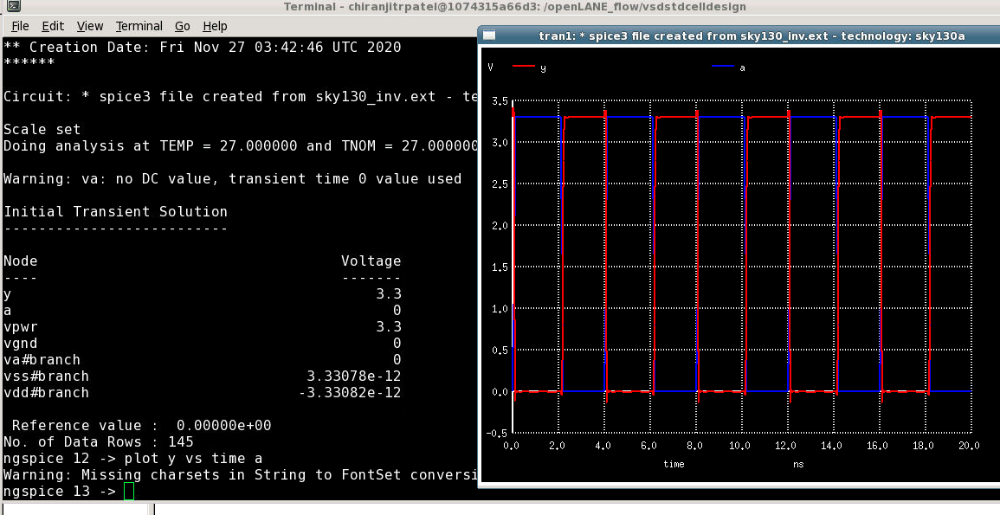
After this step, the rise time, fall time and propagation delay of the inverter are calculated.

# Day 4 - Pre-layout timing analysis and importance of good clock tree
The auto PNR tool will use the abstract view of the layout. the abstract view will contain only the information that is required by the PNR i.e., the metal and pin information.
The picture below shows the offset and pitch of a given layer in both the X and Y axis. Pitch of any layer is the distance between two centers of that layer. Offset is the distance form the origin. This offset is equal to half the pitch to maintain the half DRC.
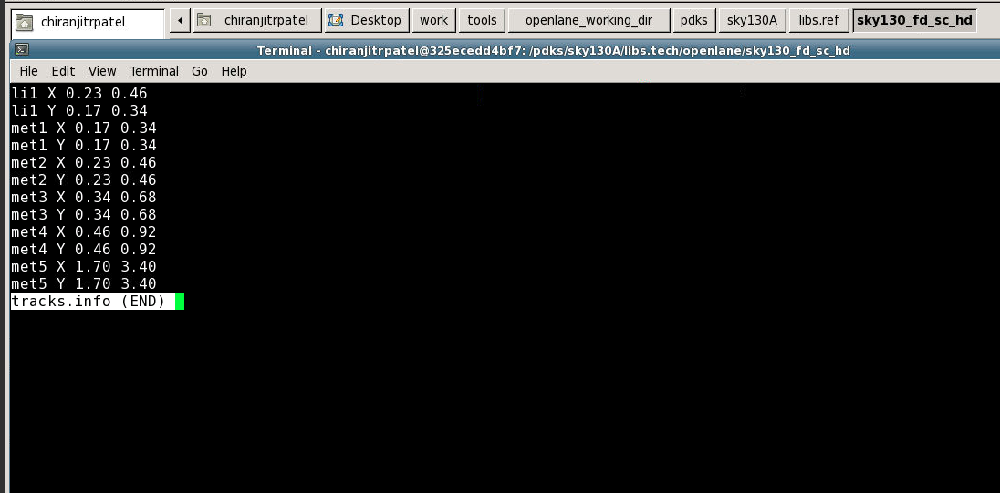
The pins that are placed in a standard cell cannot be at any random location. They must be placed at the intersection of the li1 and metal1 grids, to ensure that the PNR can rouute successfully.
the following commands are entered in the tkcon window:

grid 0.46um 0.34um 0.23um 0.17um

grid 0.34um 0.46um 0.17um 0.23um

This displays the grid over the layout.
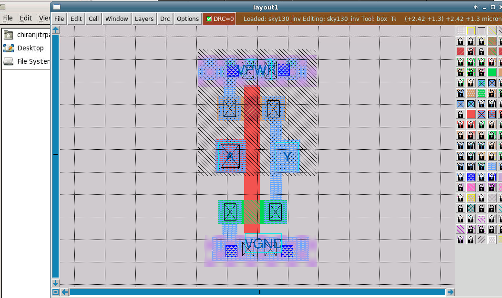
LEF Generation in Magic
Magic allows for users to generate the LEF directly by using a single command in the tkcon window:

Type "LEF write". This is create a LEF file.
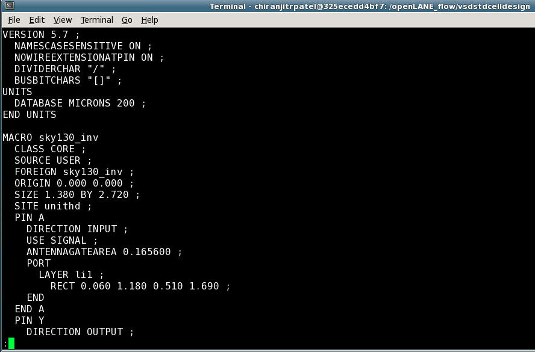
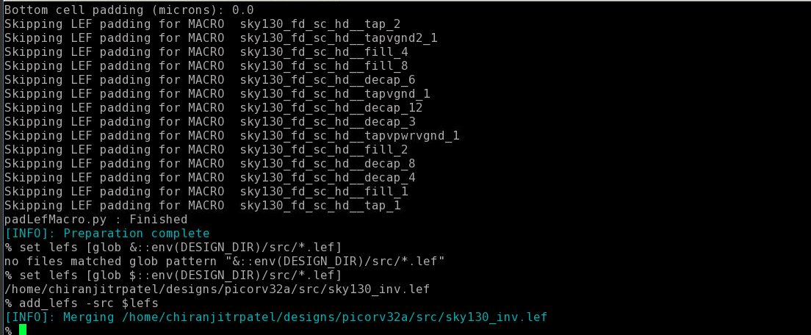
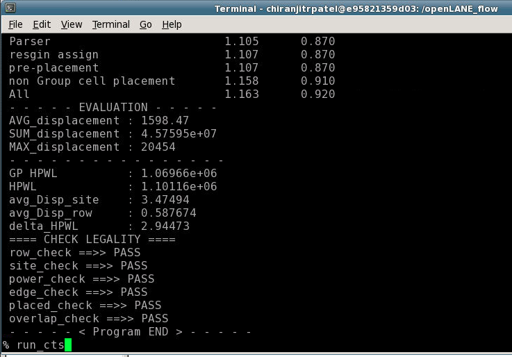
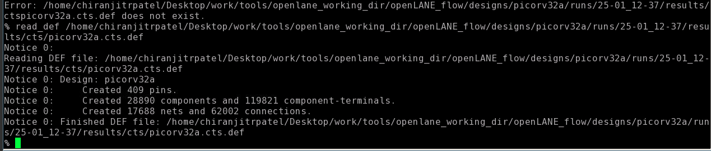
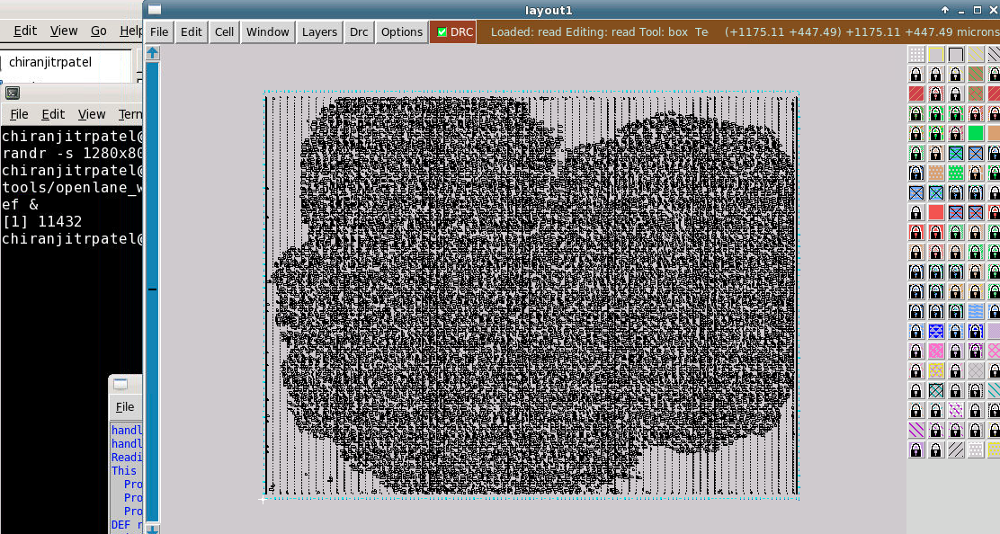
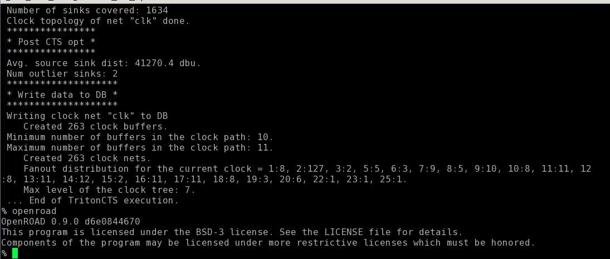

# Day 5 - Final steps for RTL2GDS

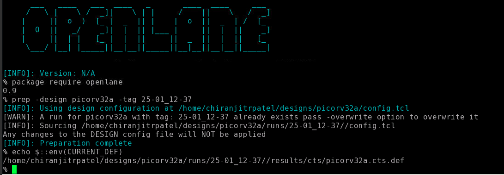

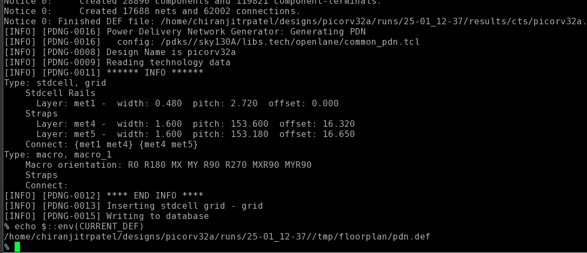
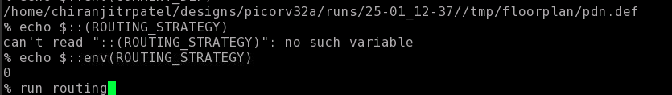
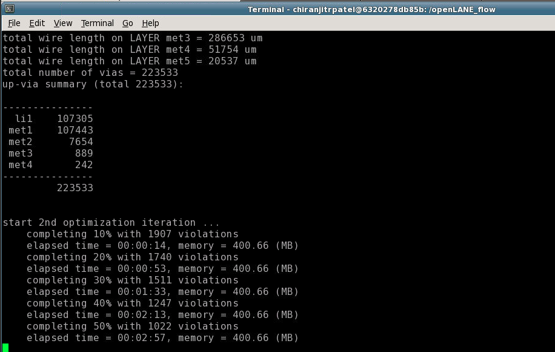

Acknowledgements

Nickson Jose - VSD VLSI Engineer

Kunal Ghosh - Co-founder (VSD Corp. Pvt. Ltd)

Praharsha
