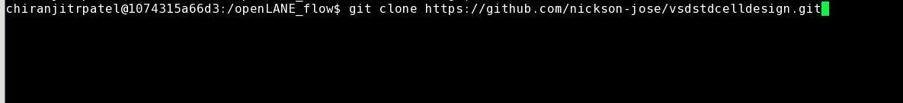

# OpenLANE-Sky130
The work done during the advanced physical design using the openlane/sky130nm workshop is illustrated in this repository. This is a cloud-based workshop offered by VSD for 5 days. The main objective here is to create, without human interference, a full and clean GDSII.

# Day1-Inception of EDA, OpenLANE and Sky130 PDK open-source
Day one focuses primarily on computer language and getting acquainted with the open source EDA using the picorv32 reference design.

We are concerned with the high density library, as shown in the below figure. There are various flavours of standard libraries also present.

flow.tcl is the file that invokes openLANE, and it is used in the interactive mode, in order to understand the flow.

The next step is to import the various packages required to run openLANE. This is done by the package require command as shown below, and the next step is to prepare our design. Iam preparing the picorv32 design. Do the following step:

It should look like this after your design has been prep'ed.

Synthesis of the design is done using the run_synthesis command as shown above.
Synthesis completion is shown as:

# Day2-Chip floorplanning and placement

Floorplan Viewing in Magic
We need to provide three files as input to imagine our floorplan in Magic:
magic tech file, Floorplan Def file and LEF File Merged.
This command is executed in the results/floorplan folder, the merged file is present two levels up, hence the ../../ and the def file is pressent in the floorplan folder.

After executing this command, magic invokes showing us the floorplan:

PLACEMENT
This is done by using the run_placement command.

Magic is again invoked to view the placement of cells, and this is done as follows:

# Day 3 - Design and characterize one library cell using Magic Layout tool and ngspice
Magic Layout View of Inverter Standard Cell

Refer to: https://github.com/nickson-jose/vsdstdcelldesign for cell files.

# Day 4 - Pre-layout timing analysis and importance of good clock tree

# Day 5 - Final steps for RTL2GDS

Acknowledgements

Nickson Jose - VSD VLSI Engineer

Kunal Ghosh - Co-founder (VSD Corp. Pvt. Ltd)

Praharsha
